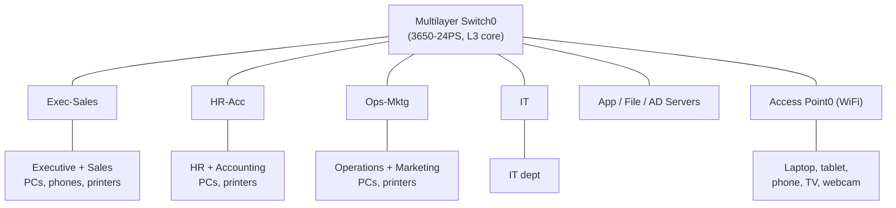
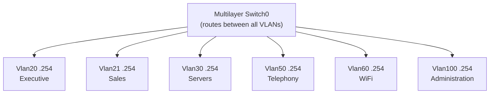
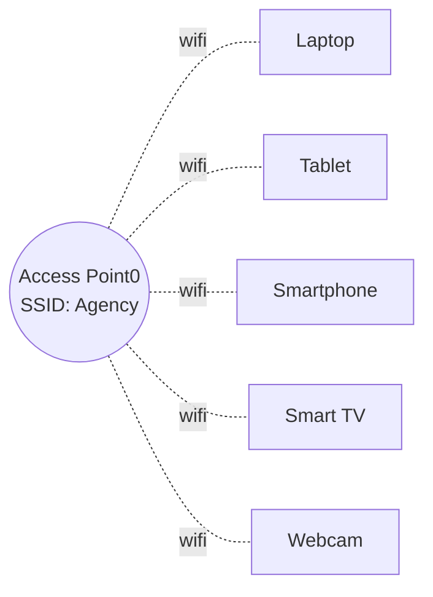
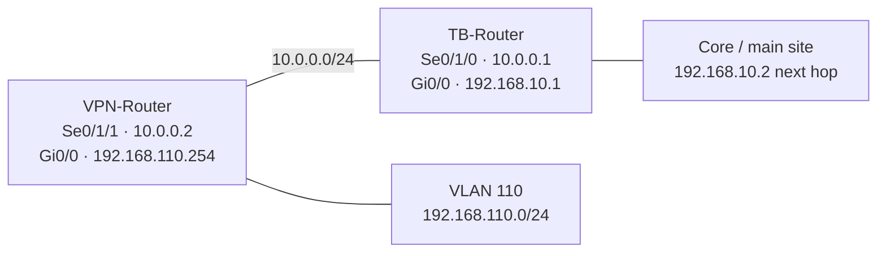

# Deployment Walkthrough

Nine stages, from an IP addressing plan to a fully routed, wireless,
multi-site network with a VPN branch — built and verified in Cisco Packet
Tracer. Diagrams below render natively on GitHub.

---

## 1. Plan the IP addressing scheme

Every department and service gets a VLAN ID, a `/24` subnet, and a
reserved `.254` gateway before any device is touched.

| VLAN | Name           | Subnet             | Gateway         |
|------|----------------|---------------------|-------------------|
| 20   | Executive      | 192.168.20.0/24     | 192.168.20.254   |
| 21   | Sales          | 192.168.21.0/24     | 192.168.21.254   |
| 22   | HR             | 192.168.22.0/24     | 192.168.22.254   |
| 23   | Accounting     | 192.168.23.0/24     | 192.168.23.254   |
| 24   | Operations     | 192.168.24.0/24     | 192.168.24.254   |
| 25   | Marketing      | 192.168.25.0/24     | 192.168.25.254   |
| 27   | IT             | 192.168.27.0/24     | 192.168.27.254   |
| 30   | Servers        | 192.168.30.0/24     | 192.168.30.254   |
| 40   | Printing       | 192.168.40.0/24     | 192.168.40.254   |
| 50   | Telephony      | 192.168.50.0/24     | 192.168.50.254   |
| 60   | WIFI           | 192.168.60.0/24     | 192.168.60.254   |
| 100  | Administration | 192.168.100.0/24    | 192.168.100.254  |

Full plan: [`docs/screenshots/35-vlan-addressing-plan-full.png`](screenshots/35-vlan-addressing-plan-full.png)

---

## 2. Lay out the topology

One Layer-3 core switch anchors everything: four access switches carry
the departments, plus direct access-port connections to the server farm
and the wireless access point.



---

## 3. Create the VLAN database on each switch

Each access switch only creates the VLANs it actually serves. Exec-Sales
needs five: Executive, Sales, Printing, Telephony, Administration.

```
Exec-Sales(config)# vlan 20
Exec-Sales(config-vlan)# name Executive
Exec-Sales(config)# vlan 21
Exec-Sales(config-vlan)# name Sales
Exec-Sales(config)# vlan 40
Exec-Sales(config-vlan)# name Printing
Exec-Sales(config)# vlan 50
Exec-Sales(config-vlan)# name Telephony
Exec-Sales(config)# vlan 100
Exec-Sales(config-vlan)# name Administration
%SYS-5-CONFIG_I: Configured from console by console
```

---

## 4. Assign ports and set static IPs on end devices

Every PC, printer, phone, and server gets a static IP in its
department's subnet, with the gateway pointed at the core switch's SVI.

```
IPv4 Address      192.168.20.1
Subnet Mask       255.255.255.0
Default Gateway   192.168.20.254
```

*(`PC1-Exec`, in the Executive VLAN)*

---

## 5. Trunk each access switch to the core

Every uplink becomes an 802.1Q trunk, native VLAN 100, carrying only the
VLANs that switch needs.

```
HR-Acc(config)# interface g0/1
HR-Acc(config-if)# switchport mode trunk
HR-Acc(config-if)# switchport trunk native vlan 100
HR-Acc(config-if)# switchport trunk allowed vlan 22,23,40,100
```


Full trunk table across all four access switches:
[README → Trunking](README.md#trunking-access-switches--core)

---

## 6. Route between VLANs with SVIs on the core

Twelve SVIs on `Multilayer Switch0` turn it into the routing backbone for
the site — this is what lets Executive reach Servers, WiFi reach
Printing, and so on.

```
SwitchL3(config)# interface vlan 20
SwitchL3(config-if)# description Executive SVI gateway
SwitchL3(config-if)# ip address 192.168.20.254 255.255.255.0
SwitchL3(config-if)# no shutdown
%LINEPROTO-5-UPDOWN: Line protocol on Interface Vlan20, changed state to up
```



Full config: [`configs/multilayer-switch0.cfg`](../configs/multilayer-switch0.cfg)

---

## 7. Bring up the wireless segment

An access point on its own access port (VLAN 60) serves a laptop,
tablet, smartphone, smart TV, and webcam — secured with WPA2-PSK/AES.

```
SSID              Agency
Authentication    WPA2-PSK
Encryption        AES
Channel           6
```



---

## 8. Connect a VPN branch over a WAN link

A second site (VLAN 110) joins over a point-to-point serial link between
two routers. A static route on the main-site router reaches the branch; a
default route sends everything else upstream.



```
TB-Router   ip route 192.168.110.0 255.255.255.0 10.0.0.2
TB-Router   ip route 0.0.0.0 0.0.0.0 192.168.10.2
VPN-Router  ip route 0.0.0.0 0.0.0.0 10.0.0.1
```

Full detail: [`configs/wan-vpn-link.cfg`](../configs/wan-vpn-link.cfg)

---

## 9. Verify end-to-end reachability

Ping every VLAN from a main-site PC, then traceroute from the branch all
the way back — confirming routing, trunking, and the WAN link all work
together as one network.

```
C:\> tracert 192.168.20.1

1  192.168.110.254   VPN-Router gateway
2  10.0.0.1           TB-Router, WAN side
3  192.168.10.2        toward the core
4  192.168.20.1        PC1-Exec — destination

Trace complete.
```

Full verification results and ping tables: [README → Verification performed](README.md#verification-performed)

---

*Built and verified in Cisco Packet Tracer — see [`README.md`](README.md) for
the full addressing plan, trunk tables, and screenshot index.*
